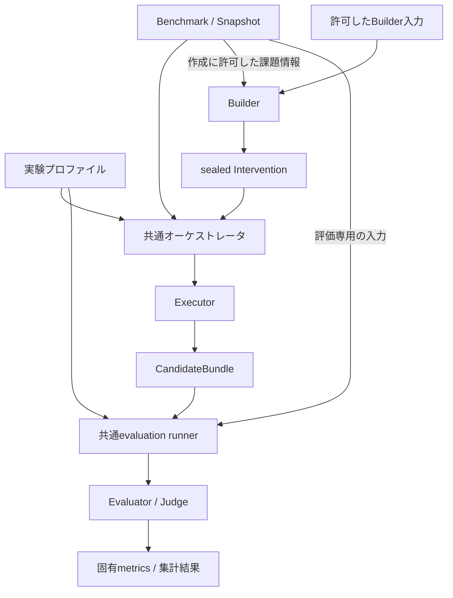

# Eval Harness：ベンチマーク中立化と実験準備の移行計画

作成日：2026-09-12  
状態：実装前の計画書。現状確認と計画のレビューを実施した。以下の変更・テストは、明記した既存実績を除き未実施。  
対象：[mashimashica/eval-harness](https://github.com/mashimashica/eval-harness)  
確認した main：`adb6adf4ec0113790a326a67325ced5716dc6837`  
Git tree：`69d6af6641e22fc42d2ffa7b71cb85f7a20e52bf`  
確認時の open PR：0。PR #36・#37 はマージ済み。

## 1. 決定と到達点

後方互換は要求しない。入口を `./eval` に統一し、GDPvalをAIME26・BigCodeBenchと同列のBenchmarkアダプタにする。実行・評価・記録の共通基盤にGDPval専用の別経路を残さず、既存の評価資産をアダプタと実験プロファイルから利用する。

基本構成は **Benchmark × Executor × Intervention × Evaluator** とする。BuilderはInterventionを生成する前段であり、第5の比較軸にはしない。実験プロファイルはこれらの組合せ、入力、役割別モデル設定、試行順序、評価・集計条件を記述する。

完遂とは、新しいCLI・契約・記録形式で実行から評価まで接続し、決定論的な受入検証をGitHub Actionsで完了し、置換済みの旧経路を削除した状態をいう。READMEの書き換えや旧コマンドのラップだけでは完了としない。

### 1.1 維持する意味と廃止する互換性

| 対象 | 方針 |
|---|---|
| `./gdpval`、旧CLIオプション・旧import・汎用処理の`GDPVAL_*`設定 | 廃止。互換ラッパー、別名、旧形式への自動フォールバックは作らない。 |
| 共通workspaceの`.gdpval`、`GDPVAL_TASK.md`等 | 中立な名称・構成に変更。既存出力の一括改名はしない。 |
| 旧harnessのrun schema・出力レイアウト | 読取互換・自動変換を要求しない。未対応形式は明瞭に拒否する。 |
| 過去の成果物・結果・ログ | 変更・上書き・削除しない。新形式のrunは新しい出力先に作る。 |
| GDPval・AIME26・BigCodeBenchの課題と採点の意味 | 維持。BenchmarkアダプタとEvaluatorが所有する。 |
| AIME26 `accuracy`、BigCodeBench `pass_rate` | 固有の指標、分母、集計条件を維持。一つのuniversal scoreに変換しない。 |
| GDPval rubric、blind pairwise、AA-v2の参照・試行・集計手順 | 必要な評価機能として共通基盤へ統合。旧CLI互換とは切り離して扱う。 |
| ベンチマーク固有の入力形式・AA-v2参照manifest | アダプタが読む正規の入力として扱う。旧harnessの互換層とは区別する。 |
| NVIDIA由来の再利用可能な実装・ライセンス | 必要な資産を保持して呼び出す。リポジトリ全体の削減や別フレームワークへの置換は行わない。 |

## 2. 現状の根拠と解消する不整合

以下は上記commitに対する静的レビューで確認した。実モデル試行による再現結果ではない。

| ID | 現状 | 移行時の解決 |
|---|---|---|
| F1 | TaskSpecはIDとpromptだけで、共通runnerはGDPval専用runnerをimportしない。基本的な責務分離は存在する。 | この境界を維持し、必要な契約を小さく追加する。 |
| F2 | Claude/Cursorは回答テキストを`ExecutionResult.output_text`に格納せず、GDPval前提の補助指示も残る。AIME/BigCodeはCodex限定。 | 出力を正規化し、ベンチマーク名ではなく必要能力で組合せを検証する。 |
| F3 | CLIはbenchmark keyから既定Evaluatorを選び、共通runnerは1候補を固定する。 | Evaluator固有IDとbenchmark defaultを分離し、明示選択・単独再評価・複数候補の組立を可能にする。 |
| F4 | Builder実験では課題の記録をruntime側に保存するが、旧GDPval judgeはout側の固定パスを探す。 | 評価用CandidateBundleを正式な入出力とし、runtimeログの位置に依存した探索を廃止する。 |
| F5 | run fingerprintはpromptのhashを含むが、実際の採点入力・参照ファイルの内容を十分に識別しない。 | BenchmarkSnapshotと内容hashを追加し、取得・materialize・評価時の改変を検出する。 |
| F6 | GDPvalのrubric・pairwise・AA-v2実評価は既存経路に残り、generic GDPvalはexternal handoff。 | 共通evaluation runnerから評価できるアダプタとAA-v2プロファイルへ移す。 |
| F7 | README・EXPERIMENTS・UPSTREAM・開発者向け説明に旧構成が残る。READMEのA/B例には介入指定もない。 | 新CLI、実際の対応表、N/S/A比較を基準に説明と例を再構成する。 |

BigCodeBenchには別venv・別processがある。OSレベルの隔離の充足は、この監査では確定していない。外部`untrusted_check`を含めた確認をPR-04の必須作業とし、依存環境の分離だけをgrader sandboxの達成とは扱わない。

## 3. 目標アーキテクチャ



### 3.1 契約と責任

| 契約・構成要素 | 所有するもの | 境界 |
|---|---|---|
| Benchmark / BenchmarkSnapshot | source・revision・選択課題・実行用入力・評価用入力・各内容hash | preparation、selection、materializationを所有する。評価の実行は所有しない。 |
| TaskSpec / ExecutionRequest | `task_id`とprompt、実行用workspace・モデル・timeout等のenvelope | rubric、正解、judge、Elo、評価用testをExecutorへ渡さない。 |
| Executor / ExecutionResult | 一回の実行、回答テキスト、成果物、実行status、ログ、runtime情報 | 採点しない。ベンチマーク名で振る舞いを切り替えない。 |
| Intervention | none、prompt overlay、files、Agent Skill等の適用と証跡 | 条件名は外側の記録に置く。モデルへ渡るのは明示した適用内容だけ。 |
| Builder | 許可した課題情報・作成用入力から成果物を生成し検証する | sealedな成果物だけをapplicationへ渡す。会話・session・他条件の出力・採点情報を渡さない。 |
| CandidateBundle | canonical task、snapshot参照、実行に渡したpromptの証跡、回答テキスト、成果物manifestとhash | 評価の正式な受渡し単位。runtimeログのディレクトリを辿る必要をなくす。 |
| Evaluator / EvaluationRequest | 候補、評価専用context、必要なjudge、結果とmetrics | 候補数・入力種別・judge能力を事前検証する。 |
| Evaluation runner / MatchPlanner | 評価の事前検証、候補の組立、順序、永続化、停止制御 | PairwiseEvaluatorには常に2候補を渡す。N候補の組合せはprofileの規則に従う。各trialはBattleRecordとして保存する。 |
| 実験プロファイル・集計 | 軸の選択、参照、試行数、順序、評価・集計条件 | 評価方式が定めた分母・重み・カテゴリ・Elo等を保つ。汎用runnerが数値を一律平均しない。 |

### 3.2 成果物と評価入力

新runには版付きのmanifestを持たせる。schema名やフィールドの最終表記はPR-01/02で固定するが、次の内容と責任は本計画で確定する。

- BenchmarkSnapshotはsource/revisionが不明な場合も実際に使用するbytesを内容hashで固定する。実行に許可する資料と、正解・rubric・tests等の評価専用資料を別のviewとして提供する。
- GDPvalの課題添付ファイルは`task_inputs`、AA-v2の参照モデル成果物は`anchor_candidates`として区別する。前者は課題の実行用入力、後者はEvaluator専用である。Builderへ渡す課題資料も作成用allowlistで指定し、snapshot全体をmountしない。
- CandidateBundleはcanonical promptと実行結果を検証可能なmanifestで結び、成果物の完全性をhashで確認する。参照はbundle内部の安全な相対参照、または明示的に束縛したimmutable snapshotの識別子に限定する。
- promptは`canonical_task_prompt`と`effective_executor_prompt`を区別して別々にhashする。前者はBenchmarkが定めた課題本文、後者はwrapper/Interventionを適用しharnessがExecutorへ渡した本文である。後者をjudgeの課題本文に代用しない。vendor内部の非公開system promptまで記録できたとは扱わない。
- `out`は評価に必要な記録と成果物を所有する。別の`runtime-root`にある生ログや実行workspaceを読むことは、評価の前提にしない。移設・別runtime配置でも同じbundleを評価できることをテストする。
- Judgeに渡すものは匿名化したcanonical task、許可した資料、候補成果物に限定する。CandidateBundleの外側にあるexecutor/model、条件名、Builder由来情報やprovenance全体をそのまま渡さない。
- 欠損・改変・schema不適合は評価前に拒否する。別パス探索や古いpromptの推測で補わない。

### 3.3 再現性の識別

promptのhash、課題全体の内容識別、runのID、runの設定fingerprintを区別する。旧フィールド互換の維持を理由に新schemaを歪めない。

新しい記録には少なくとも以下を含める。

1. benchmark ID、source、revisionとavailability、snapshot digest、task ID。
2. canonical prompt、effective executor prompt、実行用資料、評価用情報、materialized file manifestの内容digest。
3. ExecutorのID・version・model・runtime・auth方式、requested reasoning effortと取得できた実効値の状態。
4. InterventionのID・type・source/revision・manifest・file/bundle hashes・適用記録。
5. EvaluatorのID・version・revision・設定・採点入力digest、Judge Executor/model/runtime/auth。
6. repository commit・変更状態・config hash、run ID、開始・終了・status、停止理由。
7. Builder executor/model/effort、allowlist入力とそのhash、Skill revision、生成artifact hash、application run IDとの対応。

識別子、timestamp、絶対runtime path等の実行ごとに変わる情報は、再現したい内容・条件のfingerprintと区別する。例えば実行ごとの絶対パスを含むeffective promptの完全なhashは実行証跡であり、意味上同じ実験設定を照合するfingerprintには論理参照・snapshot/Intervention内容を使う。seal済みbundleを移動しても、そのbundleのbytesと内容hashは変えない。

秘密情報・環境変数全体・認証ファイルを記録しない。hashのために評価専用データをExecutorへ渡すことも禁止する。controllerが明示的なExecutionView、BuilderView、EvaluationViewを構成し、CandidateBundle全体をblind judgeへ渡さない。

### 3.4 比較・集計・再開

PairwiseEvaluatorのexactly-two契約は維持する。N候補の比較では、profileが総当たり・指定baseline対各候補・anchor比較等を明示し、MatchPlannerが2候補のEvaluationJobへ展開する。異なるtask/snapshotの候補を同じjobへ混ぜない。

各trialは位置順・選んだjudge・結果・状態を含むBattleRecordを残す。集計器はこの記録から純粋にwin/loss/tie、coverage、所定のElo等を計算する。anchorや尺度が定義されていない任意の2候補比較に、暗黙にEloを付けない。

AA-v2の多段処理では、同一内容の生成候補をstage間で再利用する。再開journalはsnapshot、設定、候補、評価jobのhashを検証し、完了済み処理の不必要な再実行を防ぐ。これは新形式の完了成果物・評価記録の再利用であり、Builderの会話やapplication sessionを別条件へ引き継ぐものではない。

## 4. CLIとGDPval・AA-v2の位置づけ

以下は**移行後の目標仕様であり、現在使用できるコマンドの説明ではない**。

| 入口 | 責務 |
|---|---|
| `./eval benchmarks / executors / evaluators / interventions / profiles` | 選択可能な要素、必要能力、検証範囲を列挙する。 |
| `./eval run BENCHMARK` | taskを実行してCandidateBundleを作り、指定した評価を実行する。生成だけの場合は明示的なexecution-onlyを選ぶ。 |
| `./eval evaluate` | 既存CandidateBundleを1候補または複数候補で評価する。 |
| `./eval experiment PROFILE` | Builderの有無を含む実験条件、生成・適用・評価・集計を共通基盤で実行する。 |

Evaluatorは固有IDで選択可能にする。benchmarkに既定Evaluatorがあってよいが、native verifierから有料judgeへの暗黙の切替はしない。judgeを必要とする場合はjudge executor/model/auth等を明示し、不足をpreflightで拒否する。execution-onlyは評価済みや成功スコアとして表示しない。

AA-v2はGDPval、policy Executor、judge設定、参照データ、サンプリング・比較・集計を束ねるプロファイルとする。Stirrup経路は生成を行うExecutorアダプタとして扱い、採点はEvaluatorへ分離する。既存shell全体を呼び出す特例を残して「統合済み」とは扱わない。

GDPval固有のrubricや参照形式、AA-v2固有の集計規則はアダプタ・プロファイルに存在してよい。共通runner・Executor・Builderが`gdpval`や`alps`という名前を条件分岐に使ってはならない。登録地点が具体アダプタを知ることは許容する。

### 4.1 既存GDPval資産の移行先

以下は責務の対応表であり、ファイル全体を無条件にコピー・移動する指示ではない。

| 移植元 | 移行先の責務 |
|---|---|
| `benchmarks/gdpval/prepare.py`、`eval_harness/benchmarks/gdpval.py`、`stirrup_agent/tasks/gdpval.py` | BenchmarkSnapshot、row正規化、task input取得・materialization。 |
| `responses_api_agents/stirrup_agent/app.py` | session・tool・sandbox・生成終了処理をStirrupExecutorへ。`/verify`呼出しやjudge-only制御は共通評価経路へ分離する。 |
| `resources_servers/gdpval/app.py`、`scoring.py`、rubric用prompt | GDPvalRubricEvaluator、prompt/presentation、応答parser。通信・認証は明示したjudge runtimeに委譲する。 |
| `stirrup_agent/file_reader.py`、`gdpval/preconvert.py`、`setup_libreoffice.py` | 評価用artifact presenterと派生render。元の提出物を変更しない。 |
| `resources_servers/gdpval/comparison.py` | GDPvalのpairwise presentation/verdict parser、純粋な集計関数。 |
| `resources_servers/gdpval/judge_panel.py` | judge panel仕様・能力・重み・選択規則。秘密情報は仕様に含めない。 |
| `multistage_elo.py`、`multistage_orchestrator.py` | AA-v2のstage planner、journal、anchor選択、Elo集計。 |
| `config/gdpval-aa-v2-references.tsv`、GDPval benchmark設定 | hashで固定したprofile/evaluator資産。 |
| provider用shell設定、旧preflight・metadata・recipe制御 | 必要部分を新config/preflight/recordへ移し、置換済みshellと旧runnerをPR-10で削除する。 |

現在の参照manifestには9つのanchor IDと固定Eloがある。正式なAA-v2 profileでは、manifest、task/repeat別のanchor成果物、judge panel、seed・trial・位置順・stage別task/anchor選択・reuse・集計規則をhash付きで束縛する。必要anchorが欠けたまま同じprofile IDで規模を縮小しない。部分的な試行は、異なる設定とIDを持つ別profileとして区別する。

## 5. 実装の順序とPR境界

原則として次の11本を依存順に積む。番号は計画IDであり、GitHubのPR番号ではない。最初は実装開始時に再確認したmainをbaseとし、以降は直前PRのheadをbaseにする。

各PRは本書の共通不変条件を継承する。Solの設計・レビューで一つのPRの責任範囲が大きすぎると判断した場合は、同じ受入条件を維持して分割する。コード品質や旧経路削除を後続の未定タスクに移して完了扱いにしない。

| PR | 目的・主な変更範囲 | 個別の完了条件 |
|---|---|---|
| PR-01 | **BenchmarkSnapshotと内容識別**。`benchmarks/base.py`、3アダプタ、`provenance.py`、schema/fixture。 | promptを変えずに正解・test・参照資料を変更した場合もdigestが変わる。source取得後の改変を拒否する。採点情報はTaskSpecに入らない。 |
| PR-02 | **CandidateBundleとrun記録**。`runner.py`、`layout.py`、新manifest/bundle処理。 | out/runtime分離下でcanonical task・成果物・snapshotを結び付ける。bundle移設、欠損、改変を決定論的に検証し、旧judgeの固定パス探索への依存を新経路からなくす。 |
| PR-03 | **Executorの中立化と能力検証**。Codex/Claude/Cursorアダプタ、registry、型付き出力parser。 | 固定GDPval指示を除去。対応するstructured outputから回答を正規化。壊れた出力形式を正答率0へ黙って変換しない。必要能力を満たす組合せだけを許可する。 |
| PR-04 | **graderの実行境界**。BigCodeEvaluator、grader起動・sandboxアダプタ・preflight。 | 外部`untrusted_check`まで確認し、必要なfilesystem/network/env/resource境界を定義・検証する。不足があれば隔離実装を追加。機能しない環境では採点前にfail closed。venv分離だけを合格条件にしない。 |
| PR-05 | **Evaluatorの独立選択と共通evaluation runner**。Evaluator registry、CLI、候補組立・評価記録。 | 固有Evaluator IDで選べる。benchmark defaultと登録を分離。1候補評価・2候補pairwise・複数候補の組合せを区別し、plan不適合をモデル実行前に拒否する。 |
| PR-06 | **GDPvalのrubric/pairwise評価統合**。GDPval Evaluator、judge入力projection、既存採点・匿名化資産の再利用。 | `./eval evaluate`相当の共通経路から評価できる。canonical task・参照・候補の整合、匿名化、位置反転、試行数、結果durabilityをfake judgeで検証する。external handoffをGDPval評価の完成形として残さない。 |
| PR-07 | **Stirrup/providerの生成アダプタ**。policy実行・auth/config・出力回収。 | Executorの結果に採点を混ぜない。task入力と生成成果物を共通契約へ接続。mock providerで生成経路、認証方式、timeout/systemic failureを検証する。 |
| PR-08 | **AA-v2プロファイルと集計**。プロファイル、参照binding、judge panel、stage planner/journal、protocol固有aggregate。 | 既存手順から抽出したfixtureで、参照・試行・匿名化・判定・集計・再開の対応を検証する。共通経路で完結し、旧shell/旧専用runnerを呼ばない。実score再現を未実行のまま主張しない。 |
| PR-09 | **Builder実験とN/S/Aの接続**。experiment runner/profile、生成物seal、application/evaluation接続。 | NはBuilderなし・Interventionなし。Sはskill-creator、Aは同一skill-creator＋ALPS。全条件が同じsnapshot・同じapplication設定・同じ評価経路を使う。比較groupの候補をsealしてから評価し、runtime分離下で比較まで完走する。 |
| PR-10 | **旧経路削除と説明の一本化**。`./gdpval`、置換済み専用runner・scripts・設定・旧path、README/EXPERIMENTS/UPSTREAM/開発者向け説明。 | 新経路に必要な処理が移ったことを確認して旧入口を削除する。shimを残さない。新CLI例がfake実行で成立し、GDPval特化の説明を一般的な説明の代わりに使わない。 |
| PR-11 | **組合せの受入とCIの仕上げ**。不足する統合テスト・境界テスト、既存品質workflowの必要な調整。 | 第4の小さなfixture benchmarkを、共通runner/Executor/Builderの変更なしで登録・実行・再評価できる。Gate Aの決定論的CI項目が実際の最終headで成功し、既知の移行残件が0になる。Gate Bの実モデル試行は含めない。 |

PR-06のrubricとpairwise、PR-08のprotocol集計等に独立した大きな変更が生じる場合はPRを分割する。PR-11まで問題の検証を先送りせず、各PRで該当不整合を検出するテストを先に置く。

Judge panelについて、PR-06は再利用可能なpanel選択・blind trial・BattleRecordの機構を所有し、PR-08はAA-v2固有のpanel設定、anchor binding、stage計画、Elo集計を所有する。共通機構をAA-v2側に再実装しない。

### 5.1 共通不変条件

- TaskSpecに評価情報を入れない。Builder・application・judgeに渡す情報のviewを明示する。
- 評価方式・指標・分母・試行規則を名前の変更に便乗して変更しない。
- 既存outを上書きしない。途中まで完了した結果・ログ・manifestを永続化する。
- systemic executor failure、quota/auth/protocol不適合は残タスクを停止する。正常なモデル誤答、採点不能、実行基盤の失敗を区別する。
- API/cloud/別モデル/別推論強度へのsilent fallbackを入れない。
- subprocess decodeは`errors="replace"`。秘密情報を設定hash・provenanceへ混入させない。
- 旧入口の削除は、その入口が提供していた必要な機能を新経路で検証してから行う。旧コマンド名だけのテストは廃止できるが、実際の保護動作を確かめるテストは移植する。
- 新規・変更対象sourceは型付けし、既存SPDX・DCO・品質gateを維持する。

### 5.2 SolからLunaへ渡すタスクの必須項目

目的、対象commit、変更可能ファイル、入出力contract、共通・個別不変条件、必要なテストと期待結果、完了条件、禁止事項を明記する。曖昧な判断はLunaに押し付けない。契約変更や複数責任への波及はSolへ戻し、全体方針の変更だけAstraへエスカレーションする。

## 6. 決定論的な検証計画

GitHub Actionsをコード品質の完了判定に使う。ローカルPCに開発検証や修正を宿題として残さない。ローカルで行うのは実験の準備確認と、別途許可した実モデル実験である。

| 検証 | 合格条件 | 対応するPR |
|---|---|---|
| Executor出力 | vendorの型付きfixtureからfinal text・artifactを回収できる。欠損/不正schemaは明確に失敗し、残作業を停止する。Stirrupの生成中にjudge `/verify` が呼ばれない。 | 03, 07 |
| 中立性 | 既知benchmark名を使わないfixtureでも同じExecutor・Intervention・Builder・runnerを通る。追加時の変更はアダプタ/登録/必要な評価実装に収まる。 | 03, 05, 11 |
| 内容識別 | prompt、正解、test、参照bytes、Skill、評価設定の各変更が対応するdigestへ反映される。意味に関係しないruntime移設は内容の同一性を壊さない。 | 01, 02, 09 |
| 受渡し | outとruntimeを分離し、別の実行場所からbundleを評価できる。欠損・改変・symlink・path escape・衝突を拒否する。 | 02, 06, 09 |
| native評価 | AIMEのaccuracy、BigCodeのpass_rateを正答・誤答・空回答・実行失敗で区別し、固有の意味で集計する。 | 04, 05 |
| pairwise | 2候補要件、同一task/snapshot、匿名化、位置順、試行数、win/tie/loss、partial failureの扱いをfake judgeで検証する。 | 05, 06 |
| AA-v2 | 固定のjudge応答と参照fixtureから、stage別task集合・anchor割当・vote totals・Elo・headline値を得る。中断再開後も同じ最終記録になり、旧経路への依存がない。 | 07, 08 |
| N/S/A | NでBuilderが呼ばれない。S/A入力差はALPSの追加だけ。生成Skill以外のBuilder情報がapplicationへ渡らず、評価者へ条件名が渡らない。欠損armを分母から黙って除外しない。 | 09 |
| grader境界 | ダミー秘密env、禁止パスへの読書き、network、timeout/resource制約をモデルなしのfixtureで検証する。隔離機構がなければ起動前に拒否する。 | 04 |
| 品質 | `uv`によるlocked環境、Ruff、strict typing、意味のあるunit/integration tests、厳密なcoverage 96%以上、依存関係CVE監査、secret/copyright検査が成功する。 | 全PR・最終head |

native verifier・grader sandboxに必要な依存取得はCIセットアップで固定し、モデル呼出しは行わない。no-networkと呼ぶテストは、実行中の外部通信を禁止またはmock化する。依存取得を行ったCI全体をno-networkと表現しない。

カバレッジ閾値、対象範囲、型検査、CVE検査を弱めて通さない。既知の真の失敗をallowlistやテスト削除で隠さない。正当なsynthetic fixtureのsecret誤検知だけを、根拠付き・最小範囲で扱う。

## 7. 移行完了と実験開始のgate

### Gate A：コードと構成の移行完了

- [ ] PR-01〜11の必要変更を実装・レビューし、実際の最終headで必須CIが成功している。
- [ ] `./eval`で生成、新schemaで生成済みのCandidateBundleの再評価、Builder実験を扱える。
- [ ] GDPval rubric/pairwise/AA-v2が共通契約を使い、旧CLI/専用runnerへの迂回がない。
- [ ] AIME/BigCodeのnative評価、named metrics、grader境界が検証されている。
- [ ] out/runtime分離時の評価受渡しと、採点入力・参照bytesの内容識別が成立する。
- [ ] N/S/Aが同じsnapshotと評価条件を使い、生成・適用・採点の情報境界を機械的に検証できる。
- [ ] 第4fixture benchmarkが共通コアの改修なしで追加できる。
- [ ] 旧互換入口・alias・不要な二重実装を削除し、文書とコマンド例が最終実装に一致する。
- [ ] 未解決の移行必須項目を「後でローカル確認」として残していない。

Gate Aの成立は、実モデルでの性能・vendor実環境での完全な動作・ALPSの有効性を証明するものではない。これらは次の実験で観測する。

### Gate B：ローカル実験を開始できる状態

- Gate Aを満たしたcommitを固定し、結果とruntimeはリポジトリ外の別ディレクトリへ保存する。
- 使用するCLI version・認証方式・model・requested reasoning effort・sandboxのpreflightを記録する。取得できない実効設定は不明と記録し、推測で埋めない。
- Skill CreatorとALPS入力のrevision/allowlist/hashes、benchmark snapshot、実験条件・順序seedを固定する。ALPSリポジトリはread-only。
- モデル呼出し・subscription quota・有料API・実judge rolloutは、対象と上限についてユーザーが明示許可した範囲だけ行う。
- 最初は1課題のN/S/Aで、生成物、適用結果、評価までの成立を確認する。意味上の情報漏れや採点の妥当性は人間も確認する。
- 失敗時は残タスクを停止し、既存結果を保全する。別runtimeやAPIへ切り替えて結果を補完しない。

実験はコマンドで実行する。検証専用サブエージェントや、条件ごとにWorkの会話を増やす運用を前提にしない。Builder/application/judgeの分離はharnessが実行単位として管理する。

## 8. 実施体制とGitHub運用

| 担当 | 責任 |
|---|---|
| Astra max | 全体計画、責任境界、重要な設計判断、エスカレーション、最終受入。 |
| Sol max | 各PRの設計、難しい調査・デバッグ、境界・セキュリティ判断、コードレビュー。 |
| Luna max以上 | 仕様化した実装・ファイル編集・テスト・CI検証・GitHub操作。 |

開始時と各write境界でGitHub実物のbranch/head/ancestryと適用instructionsを確認する。通常変更は直接GitHub APIでUTF-8 blob/tree/commitを作り、branchを更新し、PRを作る。Actions・Base64・一時workflowを編集手段にしない。

各commitのDCOは次とする。

```text
Signed-off-by: Mashimashica <43808210+mashimashica@users.noreply.github.com>
```

回復可能な競合は最新状態を取得して内容を保ち、再試行する。forceで解消しない。直接API経路が利用不能なら、具体的な原因を示して停止する。

PR作成・更新とdeterministic CIの確認までを実装作業の完了条件とする。将来作成するPRのmergeは、その時点の明示承認で行う。release/publishは本計画に含めない。Draft解除等で実モデルの自動レビューが起動する場合は、その副作用を起こさず人による判断とSolレビュー・品質CIでレビューする。必須の保護規則は迂回しない。

AgentIFの導入、追加のrepository rename、ALPS製品の改修、全上流環境の全面的な再設計は対象外とする。

## 9. 未確認事項を閉じる場所

「未確認」を恒久的な例外にしない。次の各点は該当PRの完了条件として解消する。

| 項目 | 解消方法・期限 |
|---|---|
| vendor structured outputの正確な形式・version差 | PR-03で対象versionの公開仕様・既存ログ/fixtureを確認し、対応範囲を明示。実モデルを呼ばずにparserを検証する。 |
| BigCode外部`untrusted_check`を含む隔離の実態 | PR-04で依存の固定版と実行境界を確認。必要な保護を実装・テストし、対応しない環境をpreflightで拒否する。 |
| 既存GDPval rubric/pairwise/AA-v2の詳細な責務分割 | PR-06〜08で既存の判定・匿名化・参照・集計処理を対応表にし、fixtureで新経路との意味の一致を確認する。 |
| 不正judge応答、truncated rubric JSON、参照欠損、全judge失敗、AV対応judge不足の扱い | PR-06〜08で元実装の規則をcharacterizeする。不正な応答を無条件に成功/tie扱いしない。集計上の扱いは明示したprofile規則として記録し、意味を変える修正には別のEvaluator revisionを付ける。 |
| 実AA-v2のanchor成果物の充足 | PR-08でmanifestに要求するID・task/repeat・file hashを検証するpreflightを実装。CIはfixtureで完全/欠損/改変を検証し、実anchorはGate Bでread-only照合する。未充足なら同profileの実行を開始しない。 |
| 実CLI・実modelでの生成/評価品質 | Gate Bの許可されたローカル実験で観測。Gate AのCI成功と混同しない。 |

## 10. 根拠となる現在の実装

- [TaskSpec / ExecutionResult](https://github.com/mashimashica/eval-harness/blob/adb6adf4ec0113790a326a67325ced5716dc6837/eval_harness/executors/base.py)
- [Benchmarkの境界](https://github.com/mashimashica/eval-harness/blob/adb6adf4ec0113790a326a67325ced5716dc6837/eval_harness/benchmarks/base.py)
- [共通runner：hash・Candidate・canonical prompt](https://github.com/mashimashica/eval-harness/blob/adb6adf4ec0113790a326a67325ced5716dc6837/eval_harness/runner.py)
- [Claude Codeアダプタ](https://github.com/mashimashica/eval-harness/blob/adb6adf4ec0113790a326a67325ced5716dc6837/eval_harness/executors/claude_code.py) / [Cursorアダプタ](https://github.com/mashimashica/eval-harness/blob/adb6adf4ec0113790a326a67325ced5716dc6837/eval_harness/executors/cursor.py)
- [Evaluatorを選択するCLI](https://github.com/mashimashica/eval-harness/blob/adb6adf4ec0113790a326a67325ced5716dc6837/eval_harness/cli.py)
- [Builder実験runner](https://github.com/mashimashica/eval-harness/blob/adb6adf4ec0113790a326a67325ced5716dc6837/eval_harness/experiments/runner.py)
- [runtimeとoutの配置](https://github.com/mashimashica/eval-harness/blob/adb6adf4ec0113790a326a67325ced5716dc6837/eval_harness/layout.py) / [既存GDPval judgeのprompt探索](https://github.com/mashimashica/eval-harness/blob/adb6adf4ec0113790a326a67325ced5716dc6837/eval_harness/local_judge_runner.py)
- [BigCodeEvaluator](https://github.com/mashimashica/eval-harness/blob/adb6adf4ec0113790a326a67325ced5716dc6837/eval_harness/evaluators/bigcodebench.py) / [外部grader呼出し](https://github.com/mashimashica/eval-harness/blob/adb6adf4ec0113790a326a67325ced5716dc6837/resources_servers/bigcodebench/bcb_runner.py)
- [固定AA-v2参照manifest](https://github.com/mashimashica/eval-harness/blob/adb6adf4ec0113790a326a67325ced5716dc6837/config/gdpval-aa-v2-references.tsv) / [多段Eloの純粋処理](https://github.com/mashimashica/eval-harness/blob/adb6adf4ec0113790a326a67325ced5716dc6837/resources_servers/gdpval/multistage_elo.py) / [既存の多段制御](https://github.com/mashimashica/eval-harness/blob/adb6adf4ec0113790a326a67325ced5716dc6837/resources_servers/gdpval/multistage_orchestrator.py)
- [既存mainの品質CI](https://github.com/mashimashica/eval-harness/actions/runs/34692465043)：移行前の実績。本計画の変更後の検証結果ではない。
